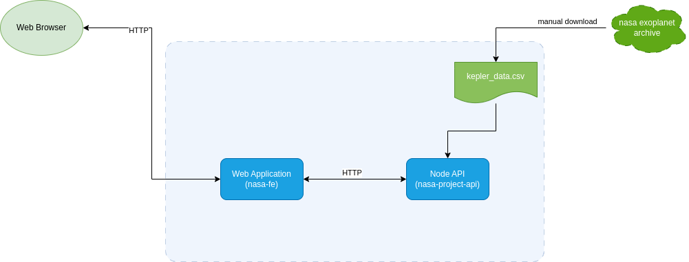

# Creating  Node API with express and React frontend

install

```bash
npm install 
```

dev and run `(front on port 3000)`  

```bash
npm run watch
```

build and run `(front on port 8000)`  

```bash
npm run deploy
```



## Testing

* jest and supertest